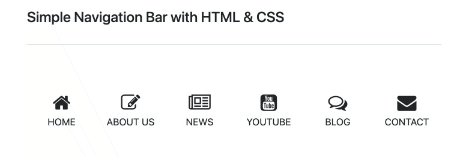

# Simple Navigation Bar with HTML & CSS

>
> 
>
> This navigation bar was built using [Bootstrap](https://getbootstrap.com/).
>

## Here are using the languages as below.
- [x] HTML
- [x] CSS
- [x] JAVASCRIPT

Related to triggering and pausing an element’s transition. The solution is actually quite simple using JavaScript. To trigger an element’s transition, toggle a class name on that element that triggers it. The following is an example of that approach.

```JavaScript
var animationEnd = 'webkitAnimationEnd mozAnimationEnd MSAnimationEnd oanimationend animationend';
this.addClass('animated ' + animationName).one(animationEnd, function() {
    $(this).removeClass('animated ' + animationName);
});
```

## You may find interesting.
- [Animate.css](https://animate.style/): is a library of ready-to-use, cross-browser animations for use. Great for emphasis, home pages, sliders, and attention-guiding hints.
